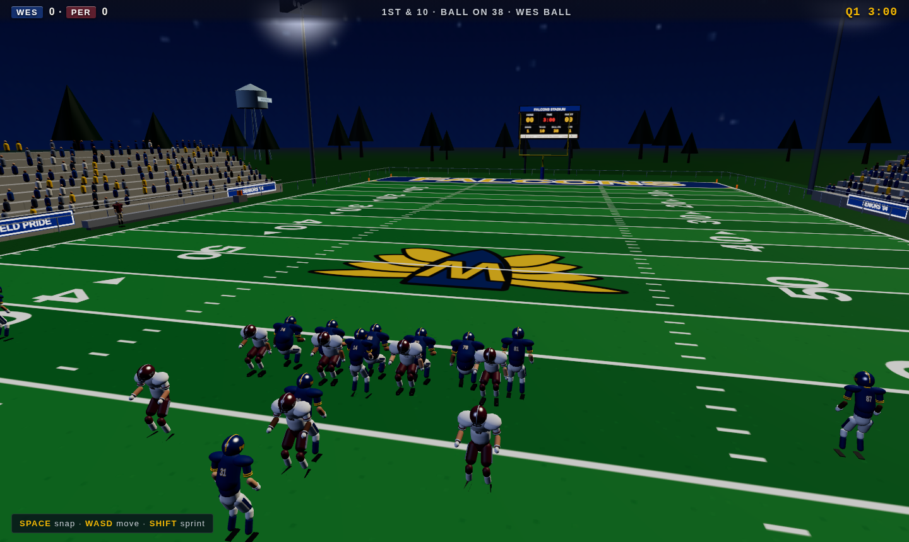
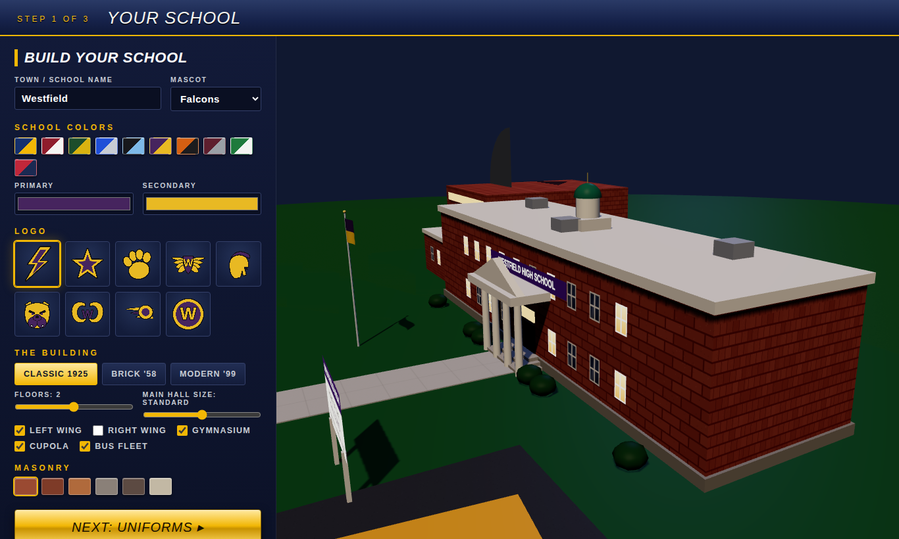
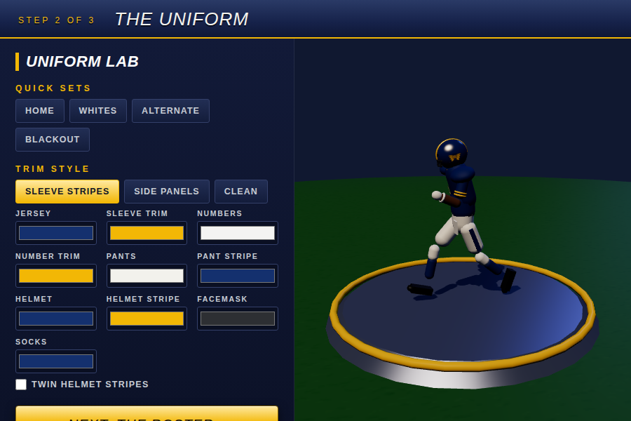
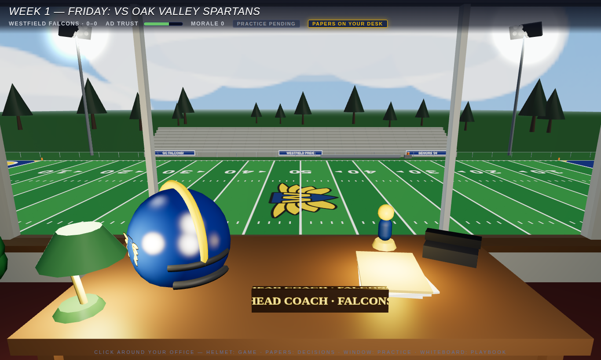
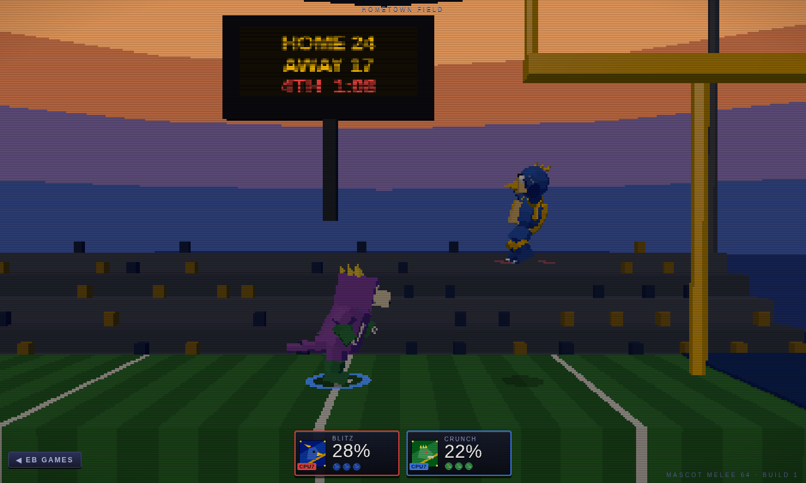
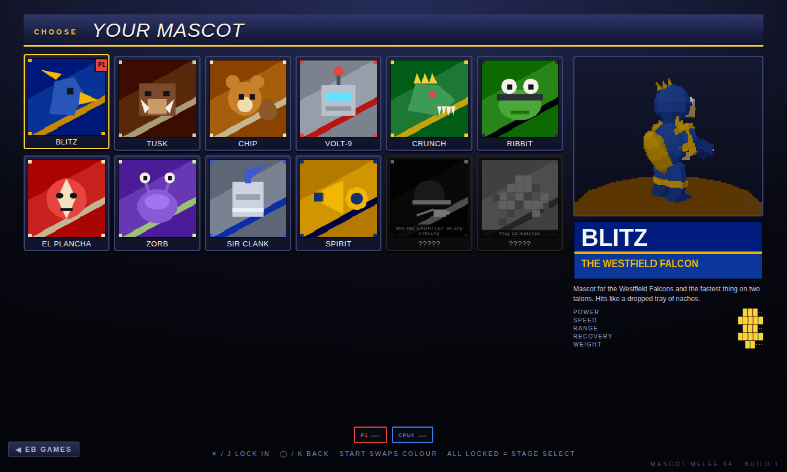
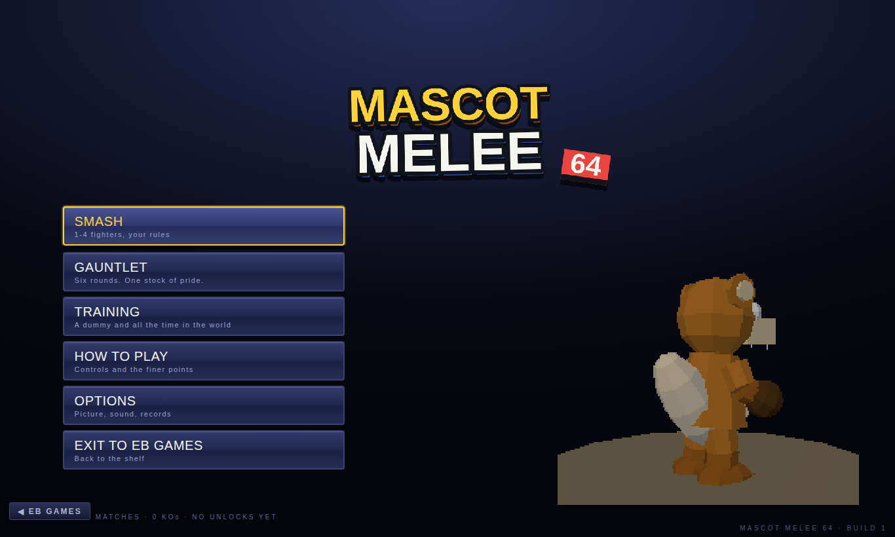
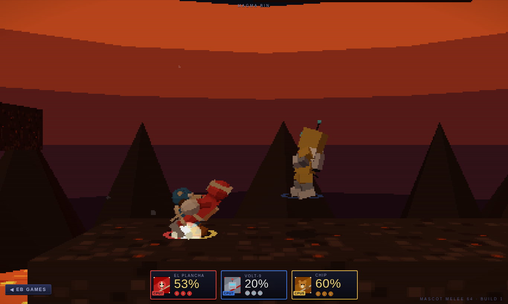
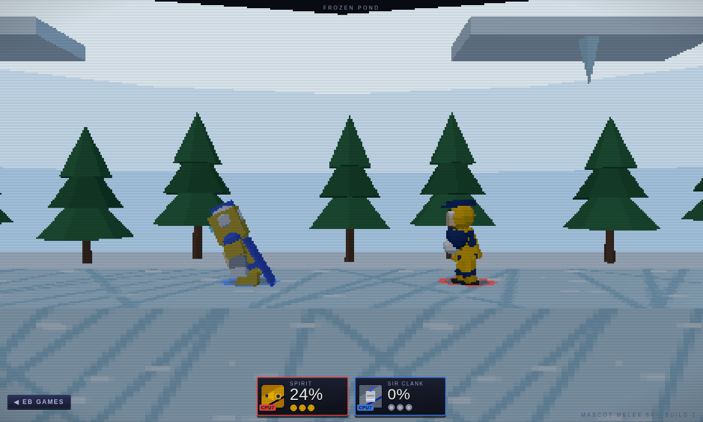

# EB GAMES 🕹️

*An in-store demo kiosk with two games on the shelf. No install, no build step,
no art assets — every model, texture, sound and note in here is generated in code.*

Double-click **`play.bat`** (Windows) or run **`python3 serve.py`** (Mac/Linux) and
the kiosk opens in your browser. Pick a game off the rack with the mouse, the
keyboard, or a controller.


---

## 🏈 VARSITY 27 — *EB SPORTS*

*Sunday has Madden. Saturday has NCAA. Friday is yours.*

The high school chapter of the football-game trinity, in full 3D. Build your school
from the bricks up, design the uniform on a live 3D player, then coach — or play —
every Friday night under the lights.

**HOMETOWN HERO** — the player career: create your QB in a full face editor, then
live the week. Allocate your hours between training, film, academics and rest;
handle what comes up (parties, scouts, chemistry finals); keep the GPA above 2.0 or
watch Friday in street clothes; play your possessions live with the defense
simulated; earn XP and college offers; survive to State and pick a hat on Signing Day.

**PROGRAM MODE** — your week starts in a 3D coach's office overlooking the field.
Click the **helmet** to play Friday's game, the **papers** for weekly decisions, the
**window** to run practice drills, the **whiteboard** to open the play designer, the
**trophy shelf** for the season. An 8-game schedule, playoffs, a State title, and an
AD trust meter that can get you fired.

| | |
| --- | --- |
|  |  |
|  |  |

**Controls** — click a play card or press its number · **SPACE** snap · **WASD** move ·
**1–4** throw · **SHIFT** sprint · **E** switch defender · **ESC** pause. Controllers
work everywhere, including the menus and the office.

---

## 🥊 MASCOT MELEE 64 — *EB INTERACTIVE*

*Twelve mascots. One ring. No mercy.*

A platform fighter with deliberately chunky 64-bit graphics: low-poly flat-shaded
rigs, 64-pixel nearest-neighbour textures, blob shadows, and the whole scene
rendered at a third of your window's resolution and scaled back up. There is no
health bar — the number under your mascot is **damage**, and the higher it climbs
the further you fly. Knock everyone else off the stage.



**The roster.** Ten fighters plus two unlockables, every one of them built in code:
**BLITZ** the Westfield falcon (fast, aerial, dive-bombs), **TUSK** the unmovable boar
(armour and a command-grab), **CHIP** the pocket-sized menace (three jumps, acorns),
**VOLT-9** the store demo unit (lasers, homing disc, reflector), **CRUNCH** the
clearance-bin kaiju (fire breath, tail sweep), **RIBBIT** the pond ninja (tongue grab,
kunai, counter), **EL PLANCHA** the luchador (suplex rush, counter slam), **ZORB**
the visitor from aisle 9 (floaty, gravity ball), **SIR CLANK** the knight of the bargain
bin (lance, shield bash, guard stance), **SPIRIT** the pep-squad captain (megaphone,
basket toss) — and two more who show up once you've earned them.

| | |
| --- | --- |
|  |  |
|  |  |

**Six stages**, each with its own hazard or gimmick: **HOMETOWN FIELD** (the goalposts
are the platforms), **ARCADE ATTIC** (shelves of boxed games), **MAGMA BIN** (lava
plumes erupt from three vents), **SKY BLIMP** (a crosswind that changes every recovery),
**FROZEN POND** (a fifth of normal traction), **THE VOID DECK** (four platforms, no
horizon).

**Modes** — **SMASH** (1–4 fighters, stock or time, items, damage ratio, CPU levels 1–9),
**GAUNTLET** (six escalating rounds ending on the void deck), **TRAINING** (infinite
stocks; taunt resets the damage).

**Two players, one couch.** Plug in two controllers, or split the keyboard.

| | Controller | Player 1 keys | Player 2 keys |
| --- | --- | --- | --- |
| Move | left stick / d-pad | **W A S D** | **arrows** |
| Jump | **□ / △** (X / Y) | **SPACE** | **NUM 0 / R-SHIFT** |
| Attack | **✕ / A** | **J** | **NUM 1 / .** |
| Special | **◯ / B** | **K** | **NUM 2 / /** |
| Shield · roll · dodge | **L2 / R2** | **L** | **NUM 3 / R-CTRL** |
| Grab | **R1 / RB** | **H** | **NUM 4 / '** |
| Smash attack | flick the stick, or the **right stick** | **SHIFT** + direction + **J** | **NUM .** + direction + **1** |
| Taunt · pause | **SHARE** · **OPTIONS** | **T** · **ESC** | **NUM 5** · **ENTER** |

A keyboard has no analog stick, so holding a direction ramps from a walk into a run,
and smash attacks come from the modifier key instead of a flick.

Tilts, smash attacks (chargeable), five aerials, four specials, grabs and four throws,
shields that shrink and break, rolls, spot-dodges, air-dodges, ledge grabs, directional
influence, hitlag, clanking attacks, counters, reflectors, stocks and sudden death.
Pick up a **MELEE ORB** and your neutral special becomes a screen-clearing finisher.

---

## Run it

**Windows:** double-click **`play.bat`** — it finds Python, starts the server, and
opens the kiosk in your browser. (If Python isn't installed it tells you where to
get it.)

**Mac/Linux:**

```bash
cd plank
python3 serve.py
# open http://localhost:8000
```

`serve.py` is a tiny no-cache static server: updates always show after a refresh, it
opens the browser by itself, and if the port is busy it picks the next free one and
says so. Any static server works — ES modules need `http://`, not `file://`. Three.js
is vendored, so there is nothing to install to play.

Pages: `index.html` is the kiosk, `varsity.html` is the football game, `melee.html` is
the fighter. Each game has a **◀ EB GAMES** link back to the shelf.

## Under the hood

Everything is generated at runtime — no model files, no textures, no audio files:

- **Fighters** (melee) — a 14-joint skeleton wearing parametric parts (beaks, snouts,
  tusks, visors, helms, pom-poms, tails, wings), ~400 triangles each, posed by a
  hand-keyed clip library with crossfades. Rigs are scaled to match their hurtboxes
  exactly, so what you see is what you can hit.
- **Athletes** (varsity) — articulated 16-joint rigs with shoulder pads, facemasks,
  number decals and four body types.
- **Worlds** — parametric architecture, procedural canvas textures at 64 px with
  nearest filtering, banded sky domes, instanced crowds, light towers, lava, snow.
- **The fight** — a fixed 60 Hz sim with Melee-flavoured knockback
  (`kb = ((p/10 + p·d/20)·1.4·(200/(w+100)) + 18)·growth/100 + base`), hitstun,
  hitlag, DI, shield stun, ledge states and blast zones. Every hitbox is authored in
  60 Hz frames and the animation is re-timed to match it.
- **CPU** — nine levels with reaction delays, spacing, edge-guarding, recovery routing
  and mash-out, all driving a virtual controller so it plays by the same rules you do.
- **Sound** — WebAudio synthesis end to end: layered impacts, UI chirps, a speech-synth
  announcer, and a lookahead chiptune sequencer with a written-out loop per stage.

The melee sim is deliberately free of three.js and the DOM, which is what makes the
test harness below possible.

## Dev

```bash
npm install                 # dev tooling only (playwright, for screenshots)
npm run smoke               # node module/rig/clip/stage checks for both games
npm run melee               # headless fight harness: frame data, move drill, matches
npm run pages               # headless Chromium: every page, real keyboard input
node tools/shot.mjs "melee.html?quick&p1=blitz&p2=tusk" fight.png --wait 6000
```

`npm run melee` is the interesting one. It validates every move's frame data, then
executes all ~310 moves against a pinned dummy to prove each one actually connects,
then plays CPU-vs-CPU matches across the roster and every stage at ~2000× realtime,
failing if anyone goes non-finite, gets stuck in mid-air, stops dying at sane percents,
or can no longer recover from below the ledge:

```
1. frame data   312 moves, 12 fighters, 6 stages checked
2. move drill   307 moves executed, all connected
3. matches      12 run, 12 finished (2200x realtime)
   length       avg 83.2s for 2 stocks
   KO damage    avg 122%  median 123%
   recovery     13 ledge grabs
```

QA URLs: `melee.html?quick` drops straight into a fight (`&p1=`, `&p2=`, `&p3=`,
`&stage=`), `melee.html?demo` runs CPU vs CPU for screenshots, `varsity.html?quick`
jumps into a football game and `varsity.html?gallery` shows every animation clip.
