# EB GAMES 95 🖥

Eight games. One repo. Zero asset files — every model, texture, animation, and
note of music is generated in code, and it all runs straight in the browser.
No install, no build step.

Run it and you land on a **Windows-95-style desktop**: double-click a
cartridge, read the box copy, hit **▶ PLAY**, and the game opens in its own
tab. Put something on the **EB Hi-Fi** first (your own files, or paste a
Spotify link) — the desktop keeps the music going while you play.

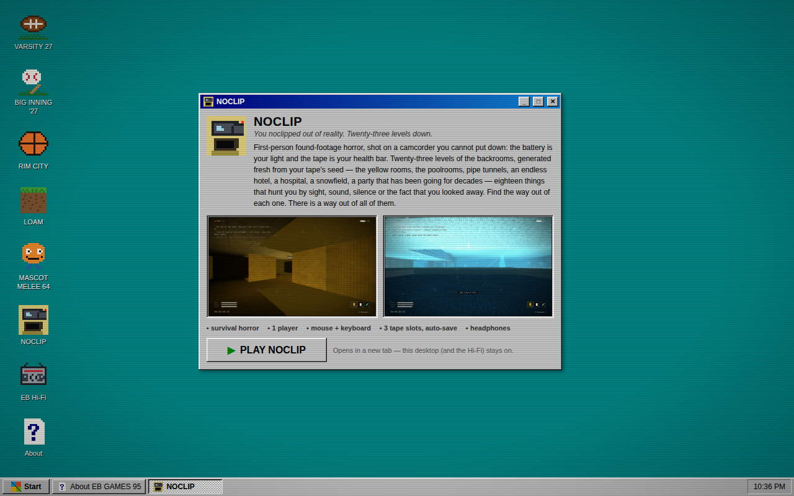

| Cartridge | What it is | Direct door |
| --- | --- | --- |
| 🏈 **[VARSITY 27](varsity/README.md)** | High school football under the Friday lights — careers, a play designer, a coach's office | `/varsity/` |
| ⚾ **[BIG INNING '27](baseball/README.md)** | Arcade baseball across six hand-built yards — seasons, free agents, Road to Glory | `/baseball/` |
| 🏀 **[RIM CITY](rimcity/README.md)** | 2-on-2 arcade basketball — turbo, shoves, alley-oops, ON FIRE, and THE RUN ladder | `/rimcity/` |
| ⛏ **[LOAM](loam/README.md)** | Voxel survival & building grown from any seed word, scored by a generative composer | `/loam/` |
| 🏆 **[MASCOT MELEE 64](melee/README.md)** | Twelve mascots, one trophy — a chunky 64-era platform fighter with a GAUNTLET ladder | `/melee/` |
| 📼 **[NOCLIP](backrooms/README.md)** | Found-footage backrooms horror: ten floors a run, one thing hunting each of them, a stall in the lift | `/backrooms/` |
| 🚗 **[QUAHOG HIT & RUN](quahog/README.md)** | Cel-shaded open world: seven levels, one Griffin each, cutaway gags on every other corner | `/quahog/` |
| 📺 **[FOCUS GROUP](focusgroup/README.md)** | Six mornings in your own flat, a 1974 commercial, and a camera that keeps taking the shot | `/focusgroup/` |

## The new one

**FOCUS GROUP** opens on a television commercial from 1974. Valco Home Products,
a family of brands, since nineteen fifty-four — an organ jingle, a family at a
breakfast table, a mascot in a bowler hat called VAL, and an announcer talking
warmly at you through a wall. *We're part of your morning.* Then you wake up in
a flat you have lived in for four years and it is Tuesday.

You live six mornings. Turn off the alarm, open the blinds, put the coffee on,
leave for work. Nothing chases you, nothing can kill you, and there is no way to
lose — the only thing that happens is that every so often the picture stops
being yours and **cuts to a hidden camera that is already in the room**. Grainy,
wide, near-monochrome, timestamped, `CAM 03`, a red dot in the corner. You keep
the controls. You are simply watching yourself make coffee from the top corner
of your own kitchen. On Tuesday it lasts seven tenths of a second. On Sunday it
never cuts back.

Twelve lenses are hidden in things you already own, and finding them fills a
friendly little **ENGAGEMENT** bar that Valco congratulates you for. A survey
card arrives on Wednesday whose fourth question has an unlabelled box. A parcel
arrives on Thursday and you choose where to put the gifts. On Friday the morning
advertisement contains your kitchen, filmed yesterday. The checklist in the
corner is the monster: by Friday it has two items on it in your handwriting that
you do not remember writing, and on Sunday the heading stops saying YOUR MORNING
and starts saying SHOOTING SCRIPT.

Every cut takes a real photograph of your playthrough, and the finished
commercial that plays over the credits is made out of them. Three endings; one
of them needs all twelve.

| | |
| --- | --- |
| 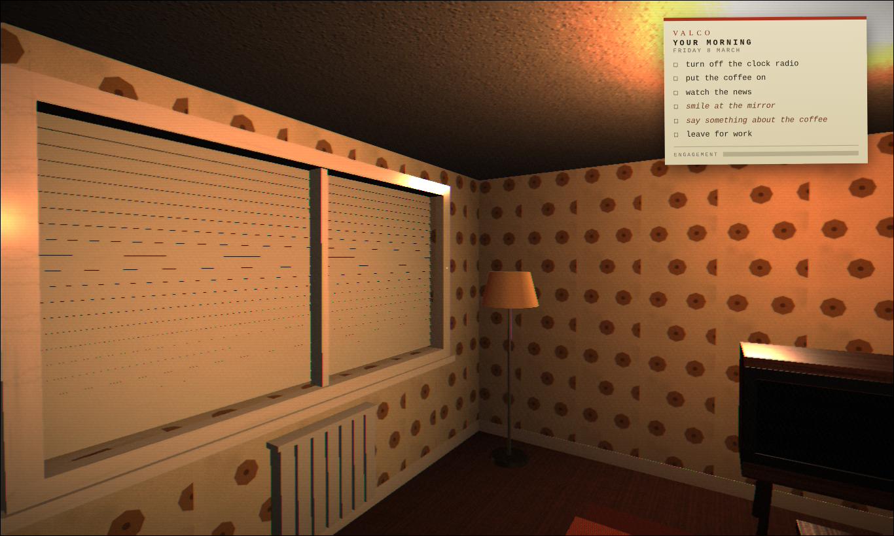 | 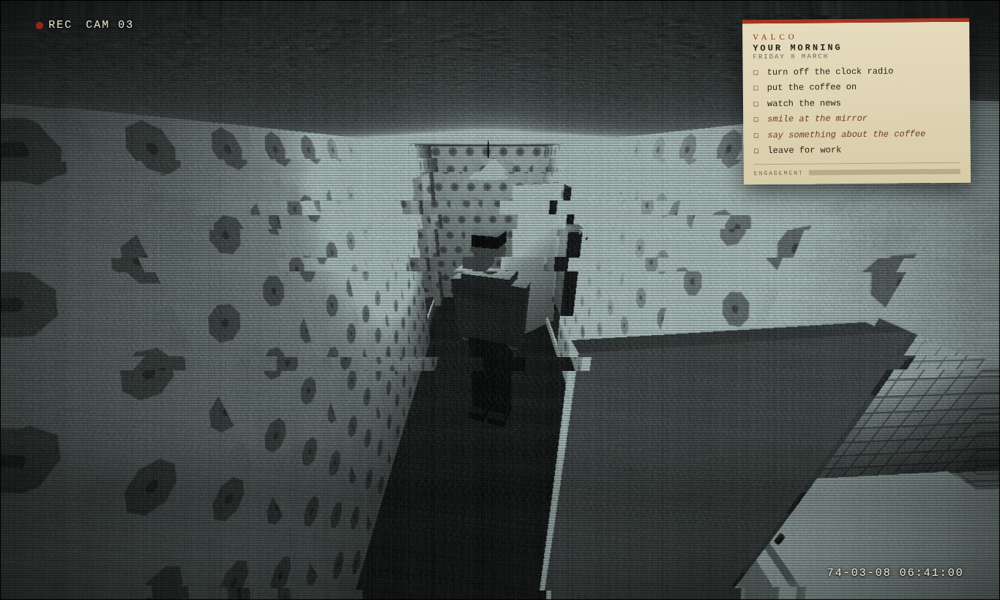 |
| 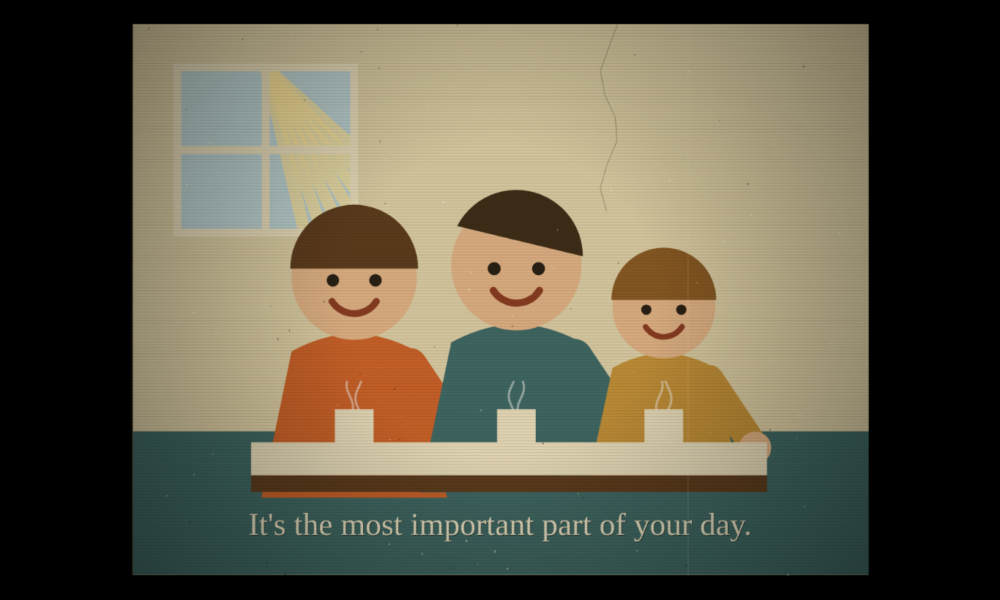 | 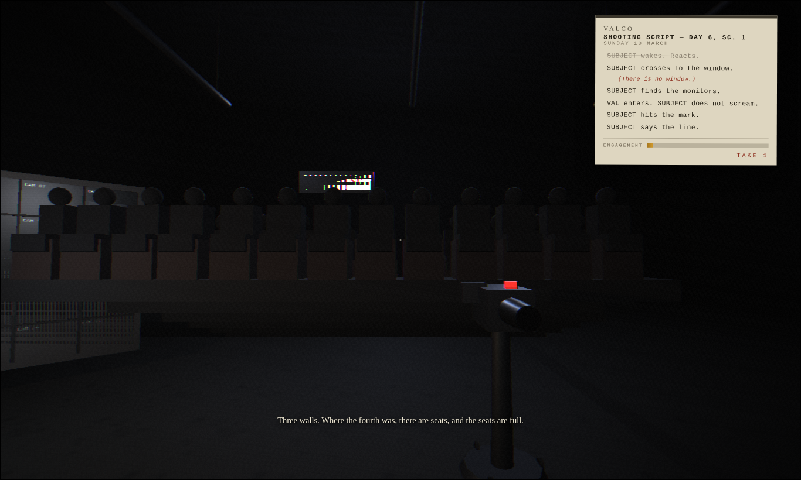 |

**QUAHOG HIT & RUN** is a cel-shaded open world built like the licensed cartoon
drivers of 2003. Seven levels, one Griffin per level, story jobs that unlock the
next one, a bonus job and seven collectibles in each — and a town you can drive
end to end in between.

Pawtucket Patriot ULTRA turns up in Quahog, everybody who drinks it starts
clucking, and the trail runs through the docks, the Channel 5 newsroom, a
Pewterschmidt bank account and a very large chicken. Every level opens and closes
with an in-engine cutscene — letterbox, cut close-ups, lip flaps, voice blips —
and **eighteen cutaway gags** are hidden on TV markers around town, waiting to
stop the game dead for a joke.

The town is not a grid: Main Street bends, an avenue cuts the south-east
diagonally, the shore road follows the water, and Spooner Street is a real dead
end with the right houses in the right order. Al Harrington's has the wacky
waving inflatable arm-flailing tube men out front. The whole cast moves around
on a 24-hour clock, so where anybody is depends on what time it is.

| | |
| --- | --- |
| 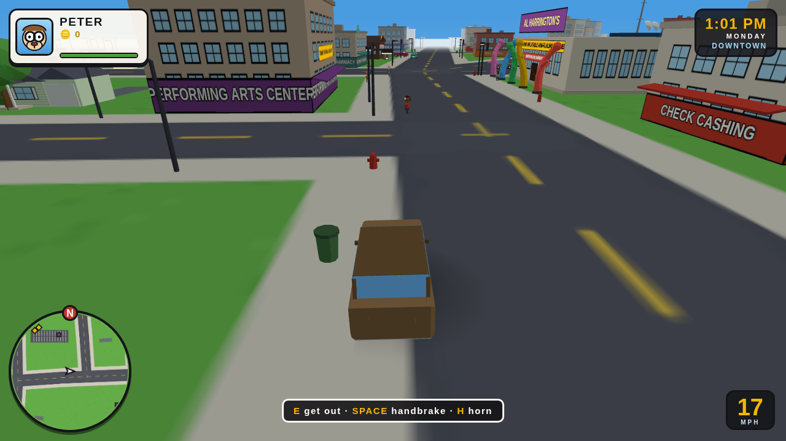 | 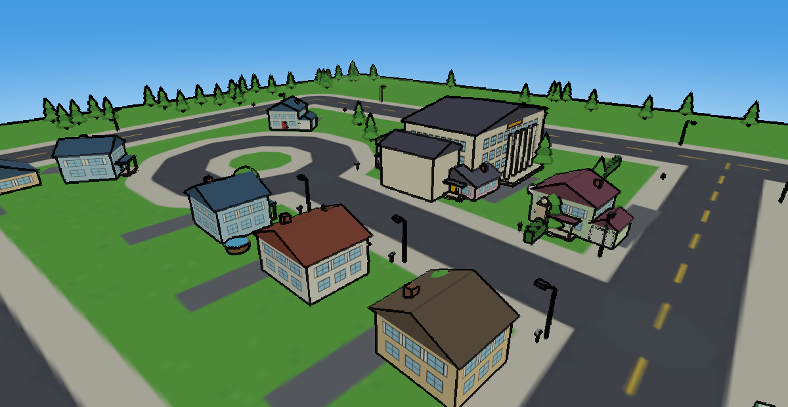 |
| 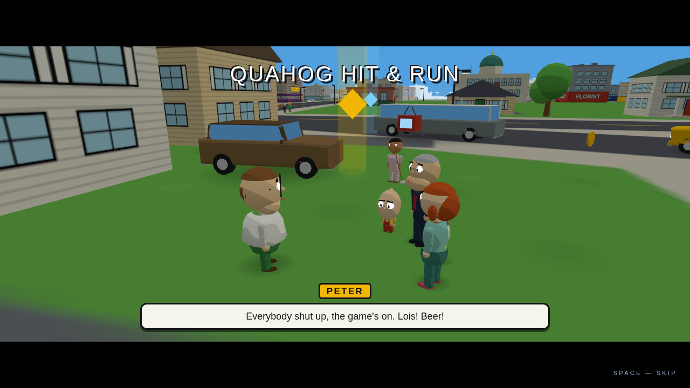 | 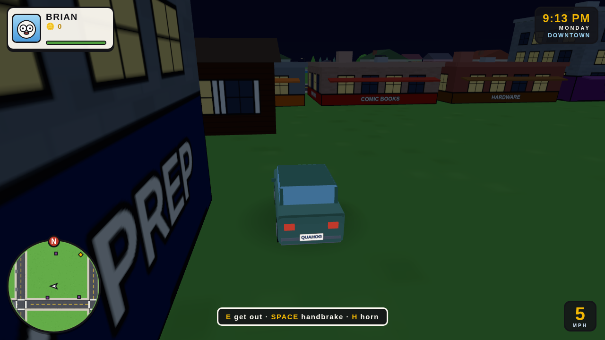 |

**NOCLIP** is a first-person horror game shot entirely through a camcorder — the
whole screen is VHS, tracking bands and all, with `REC` and a timecode along the top.

A run is ten floors down. Each one has a **service lift** to find, exactly **one**
thing hunting you (contact is death, no health bar), somewhere of its own to **hide**,
and chalk arrows somebody left pointing the way. Filming the thing that is chasing
you is what pays, and you spend the footage in the lift, where a stall sells twelve
upgrades that last the rest of the run: better shoes, a low-light CCD, a tracker pip
on the tape edge, a spare life in gaffer tape.

Somebody wrote a cheat on the inlay card before they sold the tape on: **CTRL+SHIFT+X**
outlines the monster and the lift through every wall, from anywhere on the floor.

**[NOCLIP ONLINE](backrooms/README.md#noclip-online)** is the same game in a single HTML
file for up to four people — four-letter lobby codes over WebRTC, hazmat suits with names
over them, thumb controls on a phone, and a lift that will not leave without you. Build it
with `npm run build:noclip-online`.

Twenty-three floors in the pool, drawn by depth and generated fresh each run — the
original yellow rooms, the poolrooms with the lights out under the water, pipe
tunnels, an endless hotel, a hospital with a nurse in it, a snowfield with a queue of
people facing away, a birthday party that has been going for decades.

| | |
| --- | --- |
| 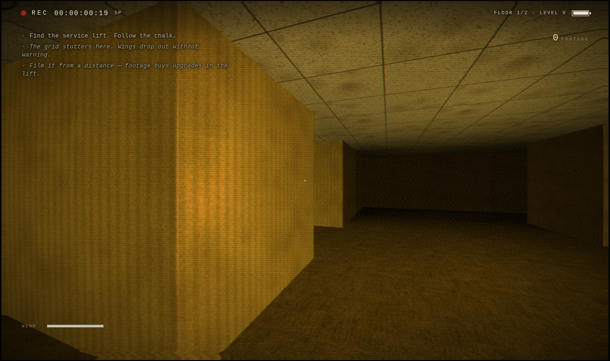 | 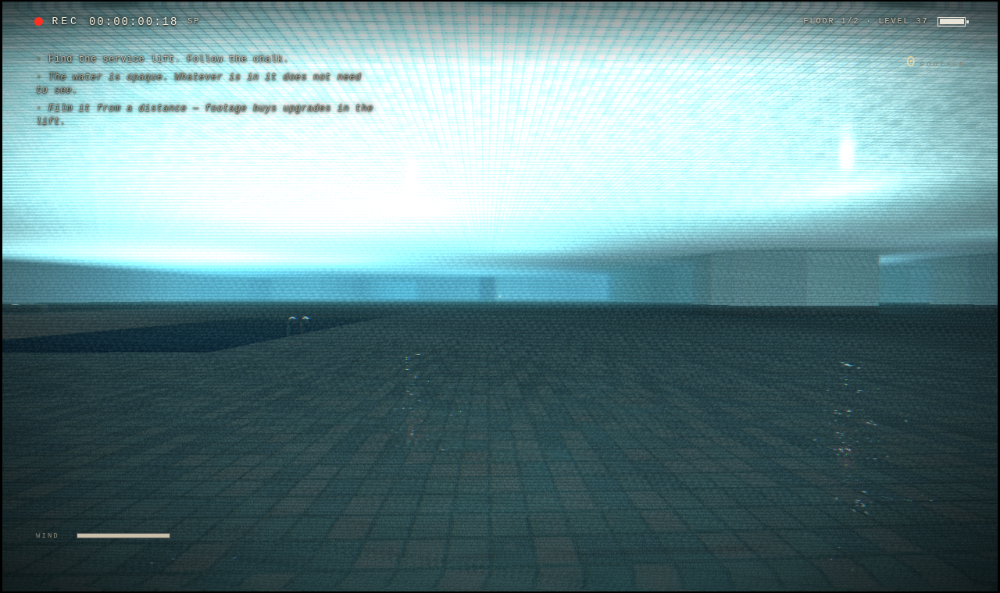 |
| 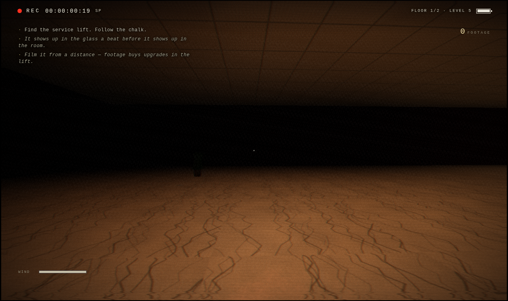 | 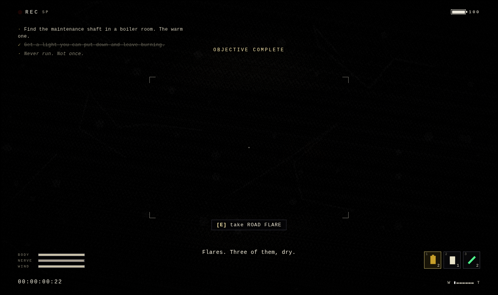 |

## Run it

**Windows:** double-click **`play.bat`** — it finds Python, starts the server,
and opens the desktop. (`rimcity/play.bat` jumps straight to basketball.)

**Mac/Linux:**

```bash
cd plank
python3 serve.py               # opens the desktop — pick a game there
python3 serve.py backrooms     # or jump straight into one
```

Any static server works too — ES modules need `http://`, not `file://`.
Three.js is vendored; `npm install` is only for dev tooling.

Plug in a **PS5 (DualSense) or Xbox controller** for the sports titles and the
fighter — press any button and the games pick it up, menus included. Everything
auto-saves to the browser: Varsity careers, Big Inning seasons, Rim City runs,
Loam worlds, Melee records, Noclip's three tape slots, how far into the week
Focus Group got and which lenses you found, and the desktop's own preferences.

## The desktop

Boots through a straight-faced fake BIOS (which now finds seven cartridges and two
tapes that were already in the drive — there was one of them last time), then it's
1995: teal wallpaper, beveled
windows you can drag, a Start menu, a taskbar clock, and an optional CRT scanline
mode. Each game's window has the pitch, two screenshots, and a big PLAY button.
**EB Hi-Fi** is the music app — load local audio files into a playlist, or paste
any Spotify song/album/playlist link (log in to Spotify in your browser for full
tracks). Games open in new tabs, so the tunes never stop.

## Dev

```bash
npm install              # playwright, for screenshots and browser smoke tests
npm run smoke            # every game's headless harness, back to back
npm run smoke:focusgroup # Focus Group: the week's wiring, all three sets
npm run play:focusgroup  # plays all six mornings headless, both endings
npm run smoke:quahog     # Quahog's town, cast, vehicles and whole campaign
npm run play:quahog      # Quahog playtest in Chromium: drives every system
npm run smoke:backrooms  # builds all 23 NOCLIP floors and checks every one
npm run play:backrooms -- --all        # plays the loop on every NOCLIP floor
npm run walk:backrooms -- --all --auditonly   # every floor: can you walk to the lift?
npm run smoke:melee      # frame data + move drill + CPU-vs-CPU matches
node tools/shot-backrooms.mjs poolrooms --frames 3     # drive NOCLIP in Chromium
node tools/shot-focusgroup.mjs --cut smoke   # sit on one of Focus Group's cameras
node tools/shot.mjs "/rimcity/?quick" shot.png --wait 9000   # screenshot QA
```

Each game carries its own harness, and each harness runs without a browser:
Loam checks its worldgen/lighting/crafting pipeline, Melee plays whole matches at
thousands of frames per second, and NOCLIP builds every level and proves you can
actually walk from the spawn to the exit before anybody has to load a page.
