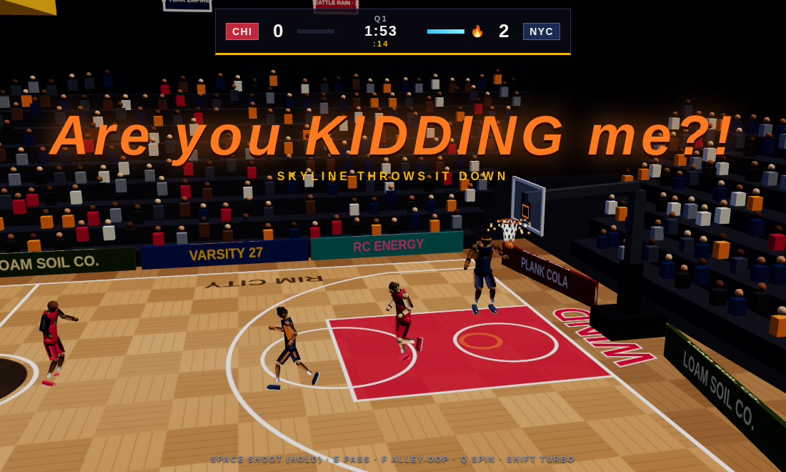

# EB GAMES 95 🖥

Three 3D games. One repo. Zero asset files — every model, texture, animation,
and note of music is generated in code, and it all runs straight in the
browser. No install, no build step.

Run it and you land on a **Windows-95-style desktop**: double-click a
cartridge, read the box copy, hit **▶ PLAY**, and the game opens in its own
tab. Put something on the **EB Hi-Fi** first (your own files, or paste a
Spotify link) — the desktop keeps the music going while you play.

| Cartridge | What it is | Direct door |
| --- | --- | --- |
| 🏈 **[VARSITY 27](varsity/README.md)** | High school football under the Friday lights — careers, a play designer, a coach's office | `/varsity/` |
| 🏀 **[RIM CITY](rimcity/README.md)** | 2-on-2 arcade basketball — turbo, shoves, alley-oops, ON FIRE, and THE RUN ladder | `/rimcity/` |
| ⛏ **[LOAM](loam/README.md)** | Voxel survival & building grown from any seed word, scored by a generative composer | `/loam/` |



## Run it

**Windows:** double-click **`play.bat`** — it finds Python, starts the server,
and opens the desktop. (`rimcity/play.bat` jumps straight to basketball.)

**Mac/Linux:**

```bash
cd plank
python3 serve.py            # opens the desktop — pick a game there
python3 serve.py rimcity    # or jump straight into a game
```

Any static server works too — ES modules need `http://`, not `file://`.
Three.js is vendored; `npm install` is only for dev tooling.

Plug in a **PS5 (DualSense) or Xbox controller** for the sports titles — press
any button and the games pick it up, menus included. Everything auto-saves to
the browser: Varsity careers, Rim City runs + settings, Loam worlds, and even
the desktop's own preferences.

## The desktop

Boots through a straight-faced fake BIOS, then it's 1995: teal wallpaper,
beveled windows you can drag, a Start menu, a taskbar clock, and an optional
CRT scanline mode. Each game's window has the pitch, two screenshots, and a
big PLAY button. **EB Hi-Fi** is the music app — load local audio files into a
playlist, or paste any Spotify song/album/playlist link (log in to Spotify in
your browser for full tracks). Games open in new tabs, so the tunes never stop.

## Dev

```bash
npm install        # playwright, for screenshots
npm run smoke      # module/clip/worldgen sanity checks for all three games
node tools/shot.mjs "/rimcity/?quick" shot.png --wait 9000   # screenshot QA
```
