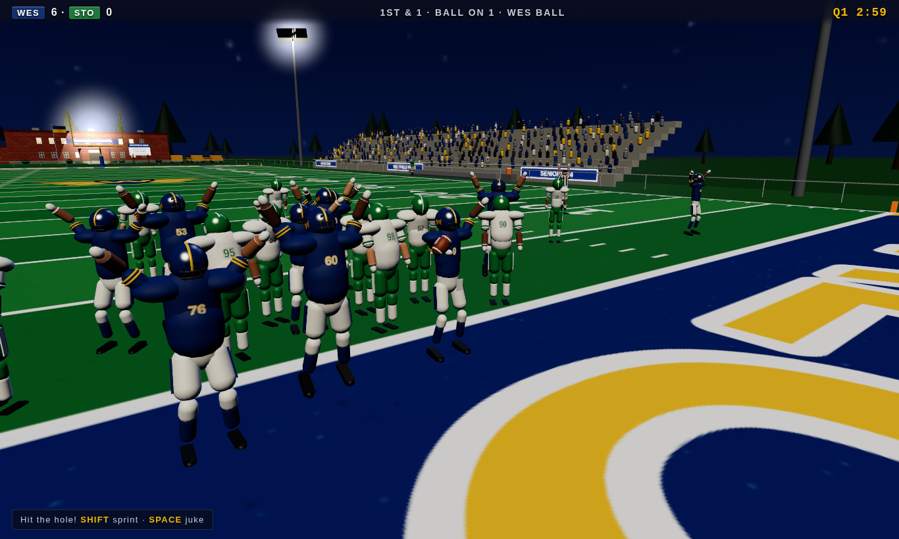
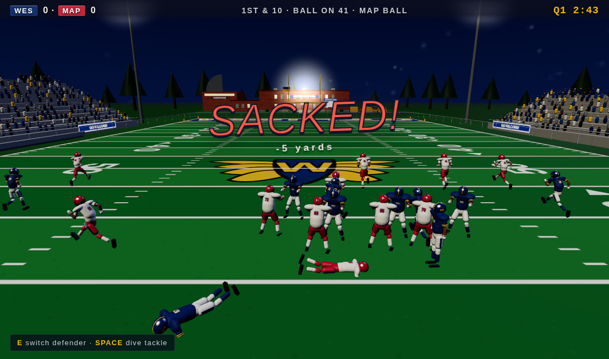
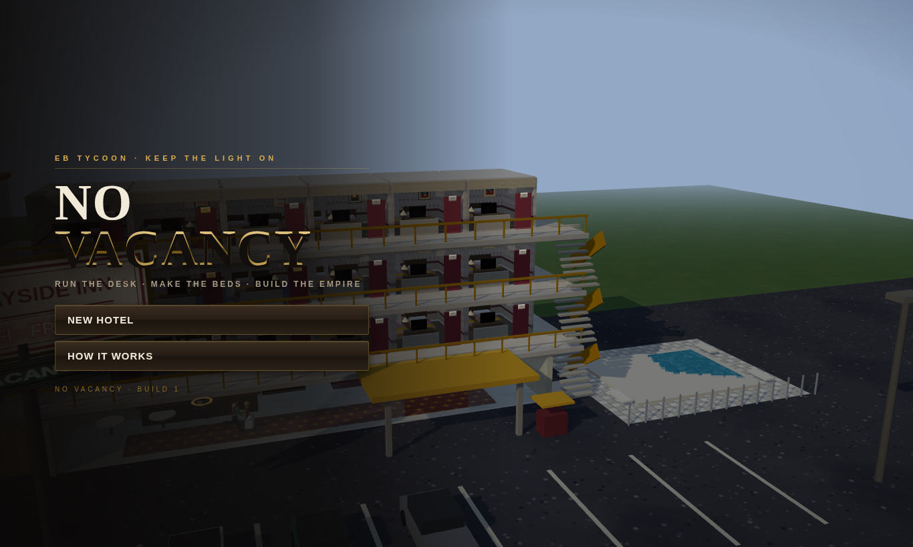
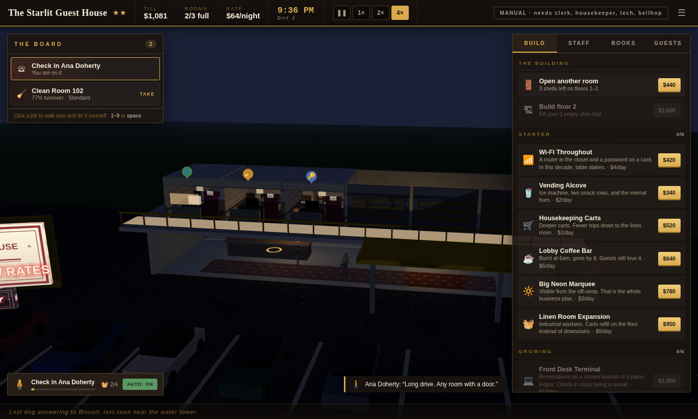
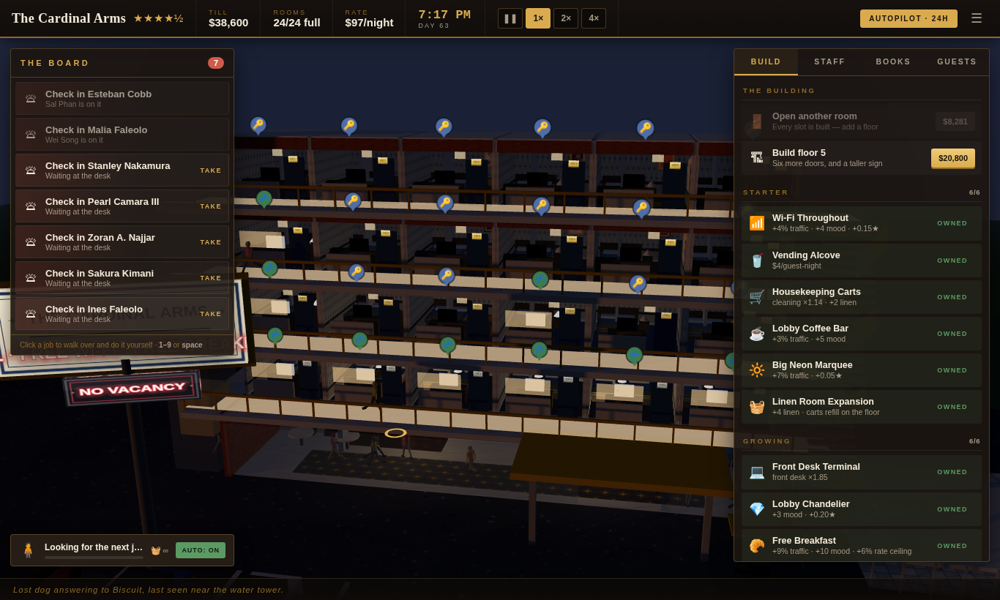
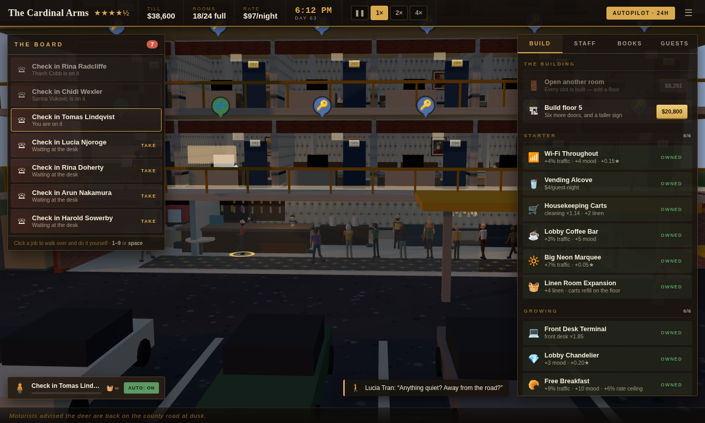
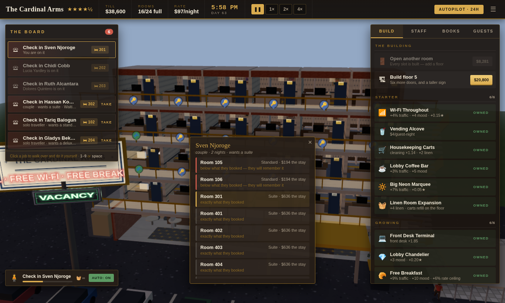
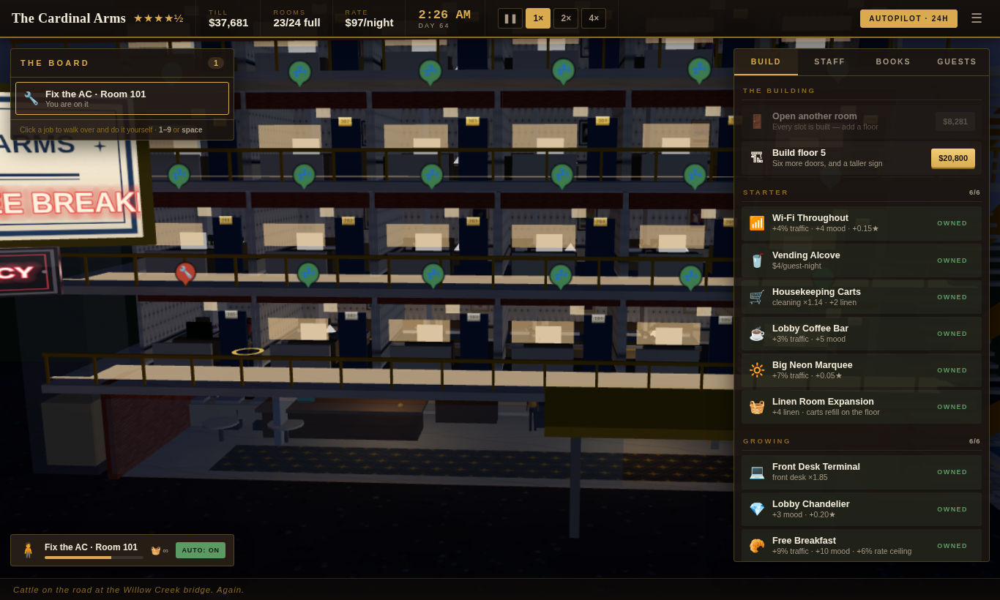

# EB GAMES 🕹️

*No installer. No launcher. No patch notes.*

A shelf of 3D games that run straight out of the browser — no build step, no npm
install, no art assets. Everything you see, from the crowd in the bleachers to the
duvet on the bed, is generated in code. Three.js is vendored.

| | |
| --- | --- |
| **[VARSITY 27](varsity/)** — high school football | **[NO VACANCY](hotel/)** — hotel tycoon |

## Run it

**Windows:** double-click **`play.bat`** — it finds Python, starts the server, and
opens the shelf in your browser. (If Python isn't installed it tells you where to
get it.)

**Mac/Linux:**

```bash
cd plank
python3 serve.py
# open http://localhost:8000  →  pick a game
```

`serve.py` is a tiny no-cache static server: updates always show after a refresh, it
opens the browser by itself, and if the port is busy it picks the next free one and
says so. Any static server works too — ES modules need `http://`, not `file://`.

---

# 🏈 VARSITY 27

*Sunday has Madden. Saturday has NCAA. Friday is yours.*

The high school chapter of the football-game trinity. Boots with a cinematic flyover
of America's football towns and an original synthesized score.

**HOMETOWN HERO** — the player career: create your QB in a full face editor (skin,
jaw, brows, eyes, hair, facial hair, eye black, visor, build), then live the week:
allocate your hours between training, film, academics, and rest; handle what comes
up (parties, scouts, chemistry finals); keep the GPA above 2.0 or watch Friday in
street clothes; play your possessions live with the defense simulated like Road to
Glory; earn XP and college offers; survive to State and pick a hat on Signing Day.


**Build your school.** Name it, pick the colors, design the logo, and raise the actual
building — style, floors, wings, gymnasium, cupola, marquee sign, bus fleet.

**Suit up your team.** Design the uniform on a live 3D player (jersey, helmet stripes,
side panels, facemask, socks — the works), then set your varsity roster: names,
numbers, and attribute re-rolls until the depth chart feels right.

**Then it's Friday night.** Full 11-on-11 under the lights against a generated rival,
in a stadium your school overlooks from the hill behind the west end zone. Animated
crowd, light towers, working scoreboard, painted end zones, your logo at midfield.

**And it's a career.** Your week starts in a 3D coach's office overlooking the field
in daylight — click the **helmet** to play Friday's game, the **papers** for weekly
decisions (eligibility scandals, booster deals, the AD on line one), the **window**
to run practice drills (Route Tree, the Gauntlet, Hit Stick — grades become Friday
boosts), the **whiteboard** to open the play designer, the **trophy shelf** for the
season. An 8-game schedule, playoffs, a State title, an AD trust meter that can get
you fired, and a paint can to redecorate the whole office.

| | |
| --- | --- |
|  |  |
|  |  |

### How to play

| Phase | Controls |
| --- | --- |
| Play call | Click a card or press its **number** |
| At the line | **SPACE** to snap |
| Quarterback | **WASD** move the pocket · **1–4** throw to that receiver · scramble past the line to run |
| Ball carrier | **WASD** steer · **SHIFT** sprint · **SPACE** juke |
| Defense | **E** switch defender · **WASD** pursue · **SPACE** dive tackle |
| Anytime | **ESC** pause · **M** mute |

**Controller (PS5 DualSense, Xbox, anything standard):** plug it in over USB and
press any button — the game announces it. **Left stick** moves (analog speed),
**✕** snaps/jukes/dives, **□ ✕ ◯ △** throw to the matching receiver icons,
**R2** sprints, **L1** switches defenders, **D-pad + ✕** picks plays,
**OPTIONS** pauses. Menus and the office stay mouse-driven.

Four 3-minute quarters. Touchdowns, extra points, field goals, punts, sacks,
interceptions, broken tackles, gang tackles, overtime. No penalties — refs swallow
their whistles on Friday night. Your school, uniform, and roster auto-save.

---

# 🏨 NO VACANCY

*Run the desk. Make the beds. Build the empire.*

You bought a three-room roadside motel and there is nobody else on shift. A hotel
management game you look into like a dollhouse — the front of every room is cut
away, so you watch the beds get stripped, the TVs flicker on, and guests flop onto
the mattress at 1am.



**Everything is your job.** The board down the left is every task waiting on you:
somebody at the desk about to give up and drive on, a room that needs turning over
before you can sell it again, the AC in 103, a guest on the phone asking for towels.
Click a job — or press its number — and you walk over and do it. Run out of clean
linen and your next cleaning job detours to the laundry room first.

**You decide who goes where.** Every arrival is provisionally given the cheapest room
that meets what they came for; click the room tag on their line to put them somewhere
else. Guests pay for the tier they *booked*, not the room they end up in, so a free
upgrade into a suite buys real goodwill and costs you the suite. Put a couple who came
for a suite into a standard and they will remember it in the guest book.

**Money buys rooms, rooms buy staff.** Open the boarded-up units one at a time, then
stack floors on top, up to thirty rooms across five storeys. Upgrade a standard into
a deluxe or a suite. Eighteen amenities, from a vending alcove to a lobby bar to a
spa, and each one shows up in the building: the pool fills in, the elevator car
actually rides the shaft, the chandelier lights the lobby at night.

| | |
| --- | --- |
|  |  |
|  |  |
|  | |

**Then hire your way out of the job.** A front desk clerk, a housekeeper, a
maintenance tech and a bellhop cover the four core roles between them — at which
point the badge in the corner flips to **AUTOPILOT** and the hotel runs without you.

**And then leave.** The simulation is driven off the wall clock, not the render loop,
so a background tab keeps trading at full fidelity while you watch something else.
Close it entirely and the crew keeps the doors open: two hours' worth on a bare
crew, six with a **Night Auditor**, sixteen with a **General Manager** — and an hour
of wall clock is seventeen in-game days, so that is a long night's trading. You come
back to a *while you were out* report: nights sold, wages paid, what your standing
did, and who turned around in the lot because nobody was on the desk.

### How to play

| | |
| --- | --- |
| **click a job** / **1–9** | take it off the board — you walk over and do it |
| **space** | take the most urgent job |
| **A** | put yourself on auto and pick up jobs like staff do |
| **drag** / **wheel** | orbit and zoom the hotel |
| **click a room** | inspect it, upgrade it, or grab its job |
| **click the 🛏 tag** | on a check-in line, to put that guest in a different room |
| **1× 2× 4×** | speed · **P** pause · **M** mute · **Esc** menu |

Stars are the shop window — they decide how many cars pull off the road and how much
you can charge. You can't review your way to five of them out of a six-room motel:
the ceiling is set by the property itself, and good service only walks you up to it.
Everything auto-saves; **CONTINUE** picks up where you left off.

---

## Dev

```bash
npm install                     # dev tooling only (playwright for screenshots)
npm run smoke                   # both games: module, rig and simulation checks
npm run balance                 # 60 in-game days of NO VACANCY, economy printed per day
npm run leakcheck               # drives the real page and asserts nothing grows per rebuild
npm run uicheck                 # the HUD bugs that only exist in a browser (slider, modals, clicks)
node tools/shot.mjs "hotel/?fresh" lobby.png --wait 20000 --keys "Space@1500"
node tools/shot.mjs "varsity/?gallery" gallery.png --wait 2500
```

`tools/shot.mjs` serves the repo and drives a game in headless Chromium. The first
argument is a page path plus an optional query (`--keys`, `--click`, `--series` and
`--eval` drive it); shots land in `qa/`.

QA URL modes — **varsity:** `?quick` jumps straight into a game, `?gallery` shows
every animation clip on a grid of rigs. **hotel:** `?fresh` ignores the save,
`?dev` starts you rich, `?showcase` boots a grown four-floor hotel with a full
crew, `?hq` pins render quality so screenshots keep their shadows.

### Layout

```
index.html · library.css   the shelf
varsity/                   VARSITY 27  (index.html, styles.css, src/)
hotel/                     NO VACANCY  (index.html, styles.css, src/)
vendor/three.module.js     shared, vendored
tools/                     smoke tests + screenshot harness
```

Inside `hotel/src`, `sim.js` is the whole hotel as pure logic — no THREE, no DOM — so
it can be stepped headlessly, fast-forwarded for offline earnings, and serialised
straight to a save. `world.js` only reads it.
