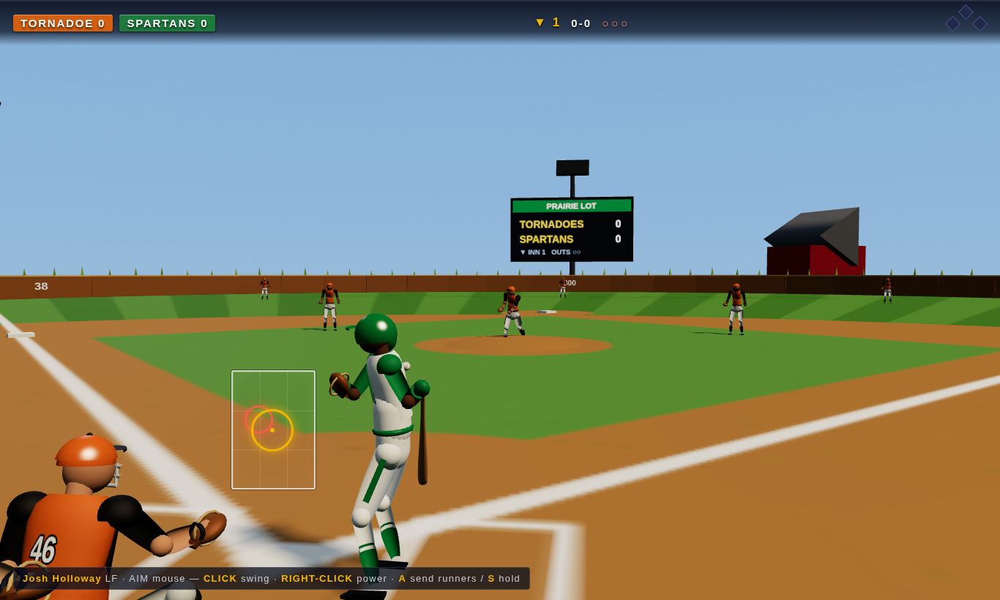
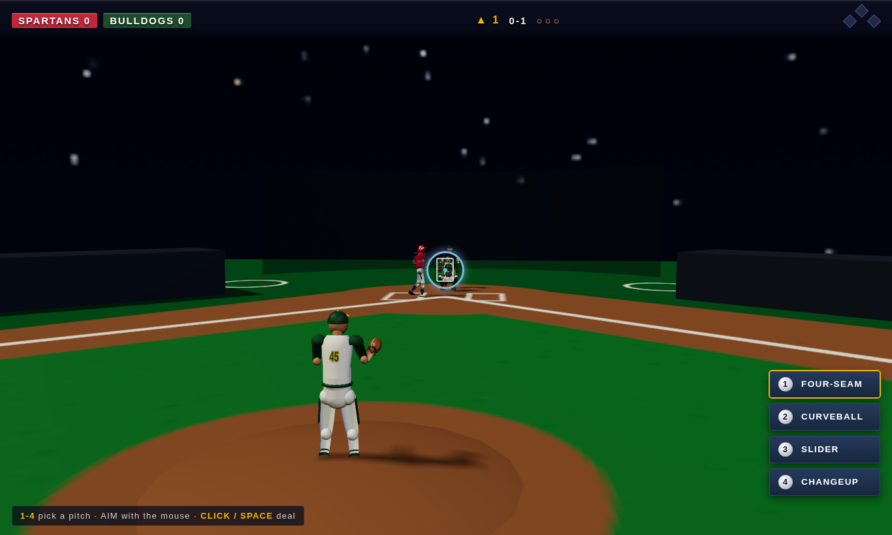

# BIG INNING '27 ⚾

*The summer game. Every yard is different.*

Arcade baseball in the browser — full 3D, no install, everything generated in
code. The camera lives where you live: **behind your batter** when you hit,
**behind the mound** when you deal.

**Batting.** A red **incoming-pitch marker** fades in and tightens on where the
ball will cross the zone — get the gold reticle on it and time the swing.
Timing pulls or slices the ball; where you meet it sets the launch. Contact
swings and power swings, foul tips, check the close ones.

**Pitching.** Four pitches — four-seam, curveball, slider, changeup — aimed
anywhere in (or just off) the zone. Command noise scales with your pitcher's
control, so the corners are earned.

**Fielding.** Your nine chase the ball on their own; when the glove has it,
throw to **1 / 2 / 3 / H** — the best force play glows. Fly outs, force outs,
double plays, tag-ups, balls off the monster wall.

**Six ballparks**, each with its own fences, light, and mood: The Green
Cathedral, Bayside Yard (splash hits), Red Mesa Field (thin air), Iron City
Grounds (night ball, monster left wall), Prairie Lot (wood fence, corn past
center), and North Grove Park (deep cold gaps).

## Modes

- **EXHIBITION** — pick a yard, play tonight. Three innings, rematch button.
- **SEASON MODE** — an 8-club generated league, 14 games, live standings,
  playoffs, and a coins economy: win purses, then sign **free agents** off the
  fence line to upgrade your roster.
- **ROAD TO GLORY** — create a ballplayer (face, build, position) and live the
  season at-bat by at-bat: your plate appearances play out live inside simmed
  games, XP training between games, scouts watching, a signing day at the end.

Careers, seasons, and settings auto-save to the browser.

## Controls

| Phase | Keyboard + mouse | 🎮 Pad (PS5/Xbox) |
| --- | --- | --- |
| Batting | mouse aims · **CLICK/Z** swing · **X** power | stick aims · **✕** swing · **□** power |
| Baserunning | **A** send runners · **S** hold | **R1** send · **L1** hold |
| Pitching | **1–4** pitch · mouse aims · **CLICK/SPACE** deal | **d-pad** pitch · stick aims · **✕** deal |
| Fielding | **1/2/3/H** throw to that bag | **◯** 1st · **△** 2nd · **□** 3rd · **✕** home |
| Anytime | **ESC** time out · **M** mute | **OPTIONS** pause |

## Run it

From the repo root: `python3 serve.py` and pick the cartridge on the desktop,
or open `/baseball/` directly. Dev: `npm run smoke:baseball` for module checks,
`node tools/shot.mjs "/baseball/?quick" shot.png --wait 9000` for screenshots.
QA hooks: `?quick` jumps to exhibition, `&park=ironcity` picks a yard,
`&turbo=6&auto` watches CPU vs CPU at speed.
