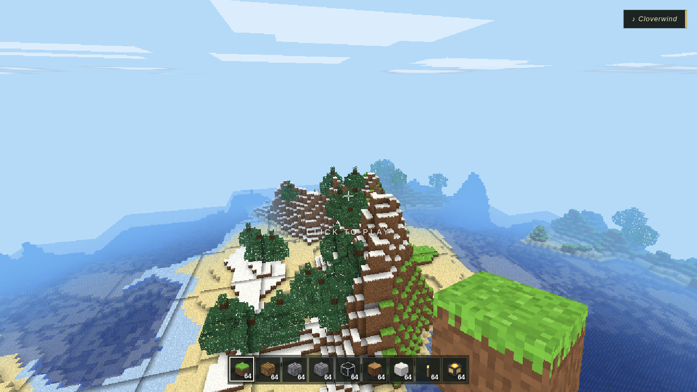
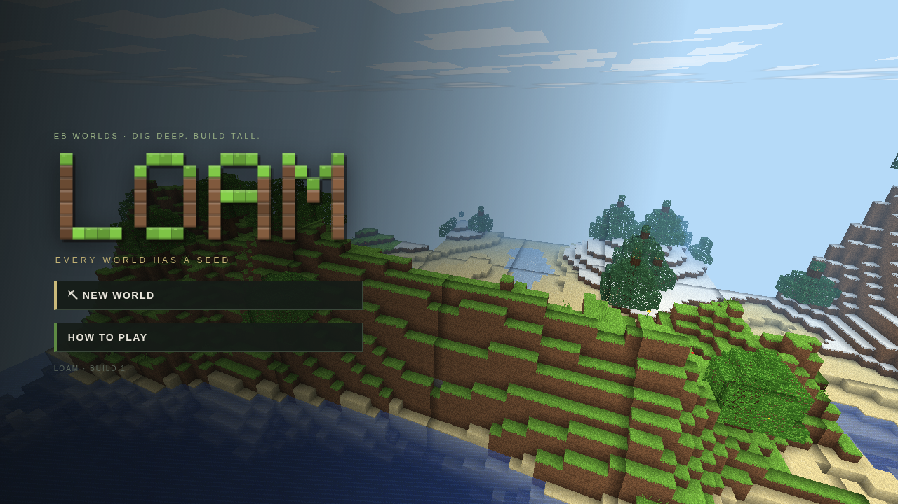
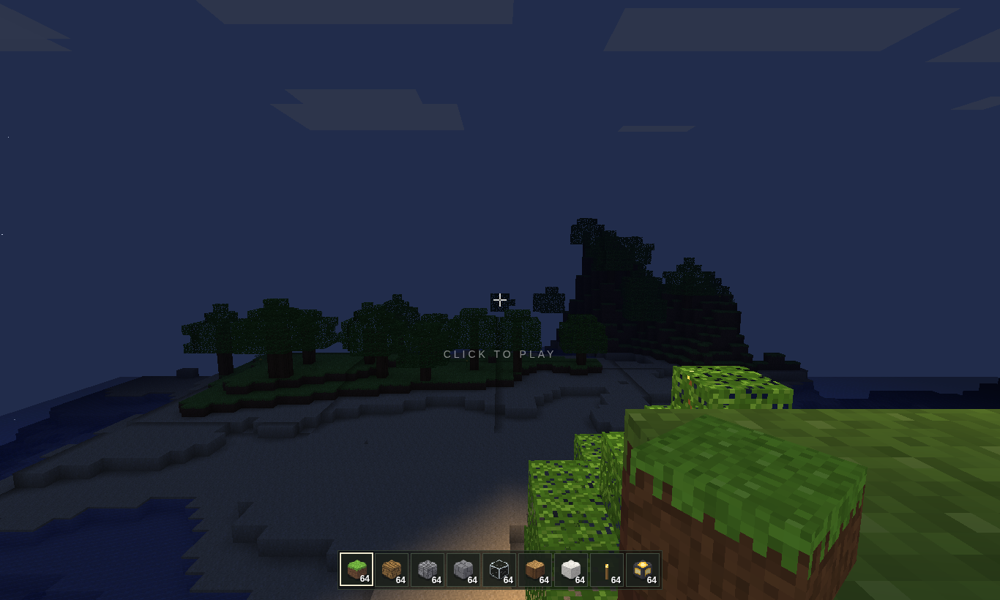
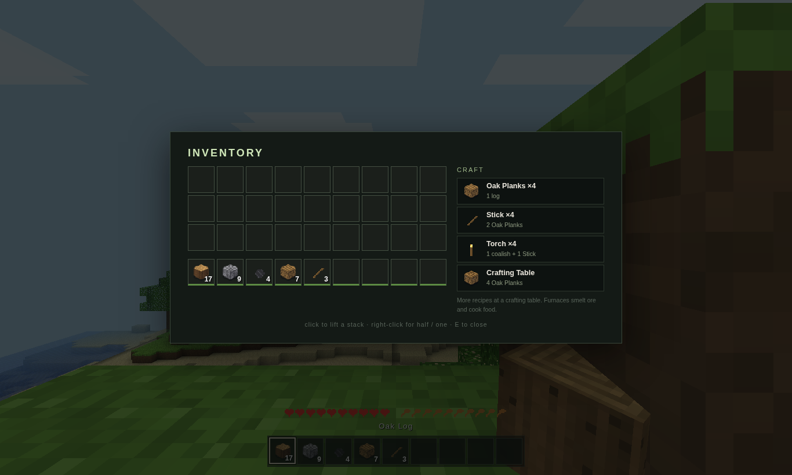

# LOAM ⛏

*Every world has a seed.*

A voxel survival-and-building game in the browser, from the same shop as
VARSITY 27 — full 3D, no install, no build step, and not a single asset file:
every texture, every creature, every block, and **all of the music** is
generated in code.



**Two ways to play.**
- **SURVIVAL** — hearts, hunger, breath. Punch a tree, craft a pickaxe, chase
  the ore ladder (wood → stone → iron → diamond), cook dinner in a furnace,
  and barricade before sundown — zombies own the night. Craft a bedroll to
  skip it and set your spawn.
- **CREATIVE** — every block, infinite pockets, instant breaking, flight
  (double-tap SPACE). Just build.

**A world from a word.** Type any seed — `garden`, `1337`, your dog's name —
and the generator unfolds the same world every time: continents and mountain
ridges, five biomes (plains, forest, desert, snow, peaks) plus oceans and
beaches, cave networks that tangle underground into lava-lit caverns, ore
veins by depth, oaks, spruces, cacti, flowers.

**Real voxel light.** Sunlight pours down and floods sideways; torches and
lanterns push warm light through tunnels (0–15 levels, flood-filled, with
smooth per-corner shading and ambient occlusion). Days roll through sunrise,
square-sun noon, dusk, starfields and a square moon. It matters: mobs spawn
by light level, and zombies burn at dawn.

**The music writes itself.** There are no audio files — a generative composer
scores the game live: felt-piano melodies with motif memory over slow chord
beds in daylight, sparse bells after dark, long-reverb drones when you're deep
underground, all crossfaded as you move through the world. Every piece gets a
name (watch for the ♪ toast). Underneath: synthesized wind, birdsong,
crickets, cave drips, and a full foley kit — footsteps that know what
material you're on, digs, splashes, groans, baas and oinks.

| | |
| --- | --- |
|  |  |



## Run it

```bash
cd plank
python3 serve.py
# open http://localhost:8000/loam/
```

(Or any static server — ES modules need http://, not file://. Three.js is
vendored; nothing to install.)

## How to play

| | |
| --- | --- |
| Look / capture mouse | move mouse / **click** |
| Mine / attack | **left button** (hold to dig) |
| Place / use / eat | **right button** |
| Move · jump · sprint · sneak | **WASD** · **SPACE** · **CTRL** · **SHIFT** |
| Inventory & crafting | **E** — click a recipe to craft it |
| Hotbar | **1–9** or wheel · **Q** drop · **middle-click** pick block |
| Fly (creative) | double-tap **SPACE** or **F** — SPACE/SHIFT for up/down |
| Pause · mute · debug | **ESC** · **M** · **F3** |

Crafting is list-style (like the console editions): pocket recipes anywhere,
the full catalogue at a crafting table, smelting and cooking at a furnace
(bring fuel). Right-click a placed table or furnace to use it.

Worlds auto-save to the browser every few seconds and on pause/quit.

## Under the hood

- **Chunks** — 16×96×16 columns streamed around the player on a frame
  budget; faces culled against neighbours, meshed with per-vertex light and
  AO, one draw call per chunk per pass (solid cutout + fluid).
- **Generation** — seeded simplex/value noise: continental + ridged mountain
  heightmap, climate map for biomes, two intersecting 3D noise fields for
  tunnels (sampled on a coarse lattice and interpolated), random-walk ore
  veins, deterministic per-chunk decoration that can lean across borders.
- **Lighting** — two 4-bit channels per block (sky, torch), column seeding +
  BFS per chunk with border exchange; the shader tints sky light by time of
  day, so dusk happens to the world, not just the sky.
- **Textures** — a 16-px atlas painted pixel-by-pixel at boot from seeded
  noise; item icons, crack decals, and the title logo too.
- **Mobs** — box-built sheep, pigs and zombies with leg-swing walk cycles,
  wander/chase/flee brains, knockback, drops, light-aware spawning.
- **Audio** — WebAudio only: a mood-driven composer (chords, walking
  pentatonic melodies with motif recall, pads, bass, bells) through a
  generated-impulse convolution hall, plus synthesized SFX and ambience.
- **QA** — `npm run smoke:loam` (node, no browser: worldgen determinism,
  lighting, meshing, crafting, physics, composer); `npm run shot:loam`
  drives the real game headless, with `?quick&seed=&mode=&t=&tp=&yaw=&pitch=`
  URL hooks and a `window.__loam` handle for probes.
